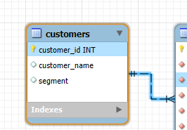
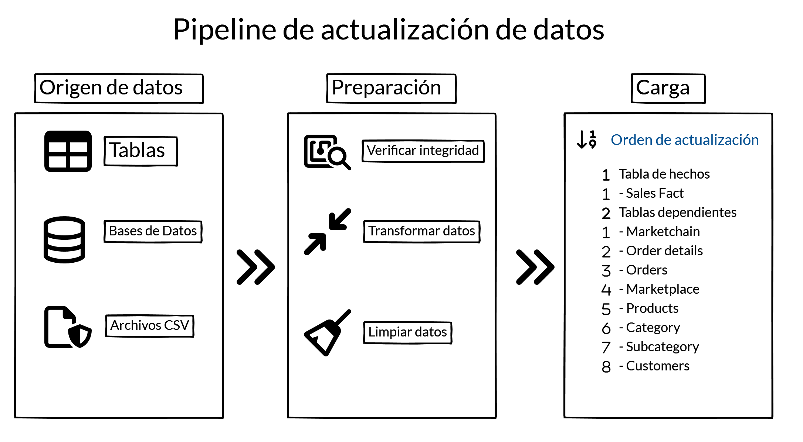
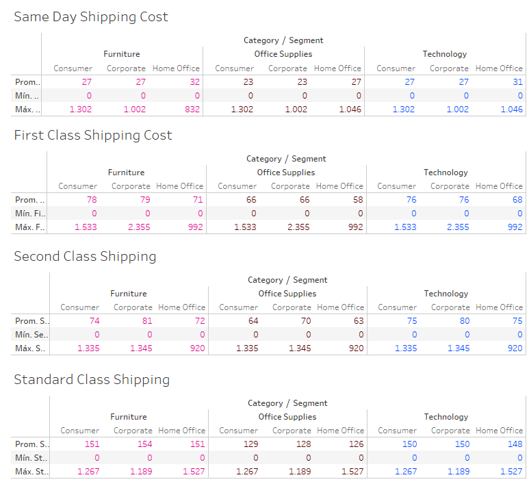
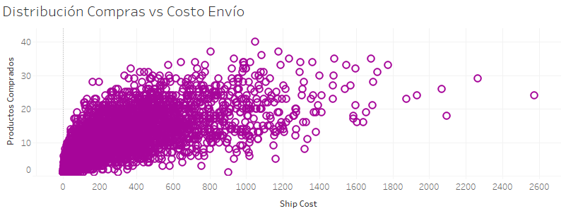
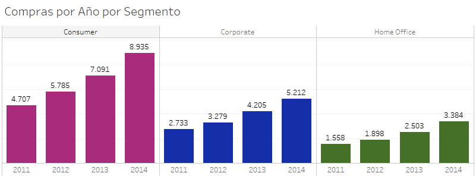
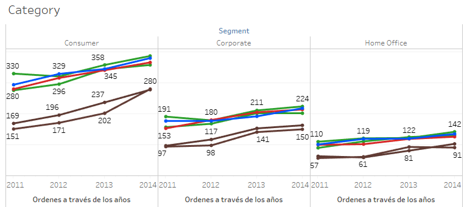
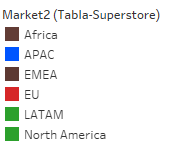
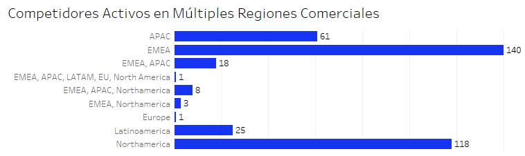
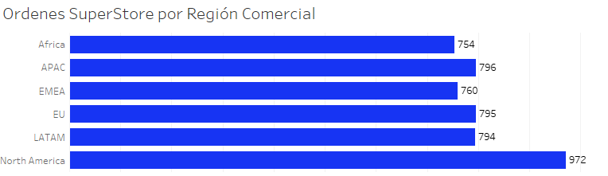

# Proyecto Profundización: Estructura de Datos - Super Store

## Caso

### Empresa

Super Store, líder en el sector minorista, se enfrenta al desafío de gestionar grandes volúmenes de datos dispersos. Para mejorar la toma de decisiones, se propone la implementación de un sólido sistema ETL con tablas de hecho y dimensiones. Este proyecto busca crear un sistema integral que extraiga, transforme y cargue datos eficientemente, proporcionando una estructura jerárquica para facilitar el análisis. El objetivo no es solo optimizar el almacenamiento, sino potenciar la capacidad de Super Store para identificar patrones y oportunidades de mercado, adaptándose a cambios en la demanda del consumidor.

### Contexto

Super Store, una empresa líder en su sector, busca optimizar la gestión de sus grandes volúmenes de datos dispersos y no estructurados mediante la implementación de un sistema ETL robusto. Este proyecto tiene como objetivo crear un almacén de datos organizado con tablas de hecho y dimensiones, permitiendo extraer datos de diversas fuentes, transformarlos según las necesidades específicas de la empresa y cargarlos de manera eficiente. Con este sistema, Super Store espera potenciar la toma de decisiones basada en datos, identificar patrones y tendencias de mercado, mejorar la eficiencia operativa y adaptarse rápidamente a los cambios en la demanda del consumidor. 

## Objetivos: 

* Preparación y Limpieza de Datos
    * Identificar y manejar valores nulos
    * Identificar y manejar valores duplicados
    * Identificar y manejar datos discrepantes en variables categóricas
    * Identificar y manejar datos discrepantes en variables numéricas
    * Comprobar y cambiar tipo de dato
    * Integración de Datos
* Conectar/importar datos a otras herramientas
    * Hacer Web scraping
    * Buscar datos de otras fuentes
* Diseño y Construcción del Almacén de Datos
    * Diseñar estructura de la base de datos (tablas de hechos y dimensiones)
    * Crear estructura de la base de datos (tablas de hechos y dimensiones)
    * Crear en BigQuery tablas de hecho y tablas de dimensiones
* Programar actualizaciones de tabla
    * Diseña un pipeline de actualización de datos
* Análisis Exploratorio
* Unir tablas

## Herramientas: 

* BigQuery
* Google Colab
* Visual Studio
* GitHub
* MySQL Workbench 8.0 CE
* Lenguajes:
    * Python
    * SQL
    * Markdown

## Datos: 

### Diccionario de datos original

| Variable | Definición                                                              |
|----------|--------------------------------------------------------------------------|
| category | Representa las categorías de productos vendidos en el hipermercado.         |
| city     | Representa la ciudad donde se realizó el pedido.                           |
| country  | Representa el país en el que se encuentra el hipermercado.                 |
| customer_id | Representa un identificador único para cada cliente.                     |
| customer_name | Representa el nombre del cliente que realizó el pedido.                 |
| discount | Representa el descuento aplicado al pedido.                              |
| market   | Representa el mercado o región donde opera el hipermercado.               |
| unknown  | Una columna desconocida o no especificada.                               |
| order_date | Representa la fecha en la que se realizó el pedido.                       |
| order_id  | Un identificador único para cada pedido.                                 |
| order_priority | Representa el nivel de prioridad del pedido.                         |
| product_id | Representa un identificador único para cada producto.                    |
| product_name | Representa el nombre del producto.                                    |
| profit   | Representa el beneficio generado por el pedido.                           |
| quantity | Representa la cantidad de productos pedidos.                            |
| region   | Representa la región donde se realizó el pedido.                           |
| row_id   | Representa un identificador único para cada fila del conjunto de datos.       |
| sales    | Representa el monto total de venta del producto en el pedido.               |
| segment  | Representa el segmento de clientes (por ejemplo, consumidores, empresas u oficinas en casa). |
| ship_date | Representa la fecha en la que se envió el pedido.                         |
| ship_mode | Representa el modo de envío utilizado para el pedido.                     |
| shipping_cost | Representa el costo de envío del pedido.                            |
| state    | Representa el estado o región dentro del país.                           |
| sub_category | Representa la sub-categoría de productos dentro de la categoría principal. |
| year     | Representa el año en el que se realizó el pedido.                          |
| market2  | Otra columna relacionada con información de mercado.                     |
| weeknum  | Representa el número de la semana en la que se realizó el pedido.           |

### Información de las divisiones de las regiones por países

| Región            | Países                                                                                                                                                                                                                                                                                                                                                                                                                                                            |
| --------------------- | --------------------------------------------------------------------------------------------------------------------------------------------------------------------------------------------------------------------------------------------------------------------------------------------------------------------------------------------------------------------------------------------------------------------------------------------------------------------- |
| APAC              | Afganistán, Armenia, Australia, Azerbaiyán, Bangladesh, Baréin, Birmania (Myanmar), Brunei, Camboya, China, Chipre, Georgia, India, Indonesia, Irán, Irak, Israel, Japón, Jordania, Kazajistán, Kirguistán, Corea del Norte, Corea del Sur, Kuwait, Laos, Líbano, Malasia, Maldivas, Mongolia, Nepal, Omán, Pakistán, Papúa Nueva Guinea, Filipinas, Qatar, Rusia, Singapur, Siria, Sri Lanka, Tayikistán, Timor Oriental, Turquía, Turkmenistán, Uzbekistán, Vietnam |
| LATAM             | Argentina, Bolivia, Brasil, Chile, Colombia, Costa Rica, Cuba, Ecuador, El Salvador, Guatemala, Honduras, México, Nicaragua, Panamá, Paraguay, Perú, República Dominicana, Uruguay, Venezuela                                                                                                                                                                                                                                                                         |
| EU                | Albania, Andorra, Austria, Bélgica, Bosnia y Herzegovina, Bulgaria, Chipre, Croacia, Dinamarca, Eslovaquia, Eslovenia, España, Estonia, Finlandia, Francia, Grecia, Hungría, Irlanda, Islandia, Italia, Kosovo, Letonia, Liechtenstein, Lituania, Luxemburgo, Malta, Mónaco, Montenegro, Países Bajos, Polonia, Portugal, Reino Unido, Rumanía, San Marino, Serbia, Suiza, Suecia                                                                                     |
| EMEA              | (Nota: EMEA es una región amplia que incluye Europa, Oriente Medio y África. Por lo tanto, aquí se incluirán algunos países en función de sus subregiones)                                                                                                                                                                                                                                                                |
| África            | Angola, Benín, Botswana, Burkina Faso, Burundi, Cabo Verde, Camerún, Comoras, Costa de Marfil, Eritrea, Etiopía, Gabón, Gambia, Ghana, Guinea, Guinea-Bisáu, Kenia, Lesoto, Liberia, Libia, Madagascar, Malaui, Mali, Marruecos, Mauricio, Mauritania, Mozambique, Namibia, Níger, Nigeria, Ruanda, Santo Tomé y Príncipe, Senegal, Seychelles, Sierra Leona, Somalia, Sudáfrica, Sudán, Sudán del Sur, Tanzania, Togo, Zambia, Zimbabue                              |
| América del Norte | Canadá, Estados Unidos                                                                                                                                                                                                                                                                                                                                                                                                                                                |
| Oriente Medio     | Arabia Saudita, Catar, Emiratos Árabes Unidos, Líbano, Siria, Turquía, Yemen                                                                                                                                                                                                                                                                                                                                                                                          |
| Oceanía           | Australia, Fiyi, Islas Marshall, Islas Salomón, Kiribati, Nauru, Papúa Nueva Guinea, Samoa, Tonga, Tuvalu, Vanuatu                                                                                                                                                                                                                                                                                                                                                    |
### Procesamiento y Preparación de Datos
---

#### Decisiones

Variables Excluidas:

* market: No se utilizará en el análisis debido a la presencia de discrepancias en las variables categóricas.
* market2: Se evaluará su inclusión en combinación con otras variables si es necesario.

Tratamiento de Datos Atípicos:

* quantity y sales: A pesar de identificar datos atípicos en estas variables, se ha decidido mantenerlos en el conjunto de datos para el análisis.

Tipo de Datos:

* Sin cambios: No se realizarán modificaciones en los tipos de datos de las variables, ya que se consideran adecuados para el análisis.

Consistencia Temporal:

* year y order_date: No se han detectado discrepancias entre estas dos variables, lo que indica una consistencia temporal en los datos.

Justificación:
* La decisión de excluir la variable `market` se basa en la presencia de inconsistencias en sus categorías, lo cual podría afectar la calidad del análisis.
* La decisión de mantener los datos atípicos en `quantity` y `sales` se justificará en función de la naturaleza del negocio y el impacto que estos valores podrían tener en los resultados. Por ejemplo, si estos valores representan pedidos muy grandes o muy pequeños, podrían ser de interés para un análisis específico.

#### Tabla de hechos y dimensión 

##### Tabla de Hechos:

* sales_fact: Esta tabla centraliza las medidas clave de las ventas.

##### Dimensiones:

* customers: Contiene información detallada sobre los clientes, como el nombre, segmento y un identificador único.

---
* orders y order_details: Almacena información sobre los pedidos, incluyendo la fecha, el estado, la prioridad y el modo de envío.

---
* products: Contiene información detallada sobre los productos, como el nombre, la categoría y la sub-categoría.

---
* category: Define las categorías de productos.

---
* sub_category: Define las sub-categorías de productos, proporcionando una mayor comprensión en la clasificación.

---
* marketplace: Contiene información sobre los mercados, incluyendo la cadena de mercado, el país, el número de ubicaciones.

---
* market_chain: Proporciona información detallada sobre las cadenas de mercado (tomando en cuenta la relación que tenemos de SuperStore y la extraída de [Wikipedia](https://en.wikipedia.org/wiki/List_of_supermarket_chains)), como la compañía, la sede central y el número de empleados.

### Relaciones entre las Tablas:

* sales_fact se relaciona con:
  * customers a través de `customer_id` para identificar el cliente asociado a cada venta.
  * orders a través de `order_id` para vincular las ventas a los pedidos específicos.
  * products a través de `product_id` para identificar el producto vendido.
  * category a través de `id_category` para clasificar las ventas por categoría.
  * sub_category a través de `id_subcategory` para clasificar las ventas por sub-categoría.
  * marketplace a través de `id_market` para asociar las ventas a un mercado específico.

* marketplace y market_chain tienen una relación uno a muchos, donde una cadena de mercado puede tener múltiples mercados.

Diagrama de las tablas de hecho y dimensiones:

#### Consultas en SQL para la creación de las tablas de dimensión

* [Categorías](SQL/dim_category.sql)
* [Clientes](SQL/dim_clientes.sql)
* [Cadena de Mercado](SQL/dim_market_chain.sql)
* [Marketplace](SQL/dim_marketplace.sql)
* [Detalle de pedidos](SQL/dim_order_details.sql)
* [Pedidos](SQL/dim_orders.sql)
* [Productos](SQL/dim_productos.sql)
* [Sub-categorías](SQL/dim_sub_category.sql)
* [Hechos de Ventas](SQL/sales_fact.sql)

#### Consulta en SQL para el unificado exploratorio

* [Unificado](SQL/exploratorio.sql)

##### Diccionario de datos resultante

| Nueva Categoría | Descripción |
|---|---|
| productos_comprados | Número total de productos comprados por el cliente. |
| compras_2011, compras_2012, compras_2013, compras_2014 | Número de compras realizadas en cada año. |
| standard_class_count, second_class_count, first_class_count, same_day_count | Número de pedidos realizados con cada modo de envío. |
| ship_cost | Costo total de envío para el cliente. |
| standard_class_ship_cost, second_class_ship_cost, first_class_ship_cost, same_day_ship_cost | Costo total de envío por cada modo de envío. |
| office_supplies_count, furniture_count, technology_count | Número de compras realizadas en cada categoría de producto. |

### Diseño del pipeline de actualización de datos

Se espera que a medida que se vayan creando las transacciones en la tabla de hechos, la información se actualice de afuera hacia adentro.

Herramientas recomendadas para manejo de pipeline de actualización de datos, tomando en cuenta que el origen de nuestros datos pueden ser nuestras tablas, bases de datos de terceros, o archivos CSV:

* BigQuery: para cargar la información o hacer las consultas necesarias.
* Google Cloud: para programar que cada query se ejecute cada cierta cantidad de horas y mantener nuestros datos actualizados.
* Google Colab: toda la etapa de preparación de los datos se puede dejar automatizado en un notebook.
* Para datos procesar mayor volumen de datos o tareas más complejas, se recomienda:

  * [Dataflow](https://cloud.google.com/products/dataflow?hl=es_419)
  * [Airflow](https://airflow.apache.org/)

## Análisis Exploratorio

### Hallazgos 

#### Costos según tipo de envío

* Poca e irrelevante diferencia entre los costos de dos categorías que se suponen deberían diferir bastante una de otra: First Class & Second Class.
* El costo de un envío que llega el mismo día es significativamente bajo, en comparación con un envío standard, el cual debería ser por su naturaleza, mucho más económico porque tarda en llegar.
----

#### Impacto del precio de envío sobre la cantidad de ventas

Se esperaría que a costos más bajos, hayan mas compras, sin embargo, como se observa en el gráfico, la cantidad de productos comprados, disminuye es cuando el costo de envío es mayor a 650$.

---

#### Compras por Año según segmento

Nuestros clientes del segmento: consumer, es a través de los años el mejor segmento en cuanto a cantidad de compras.

---

#### Ranking de Categorías ordenado por la más vendida según región comercial

Se observa que las regiones comerciales qué más compran en nuestras categorías son:
* Furniture: APAC
* Office Supplies: APAC (seguido por muy poco por AMER)
* Technology: APAC (Con una diferencia poco mayor a mil de AMER y EU)
---
#### Ordenes a través de los años por categoría

Africa y EMEA son dos regiones comerciales las cuales tienen menos compras en todas las categorías. 

----

#### Competidores y ordenes por región comercial

---

SuperStore distribuye a todos los mercados de las regiones comerciales, a diferencia de la competencia, que quienes tienen presencia en mas regiones comerciales, son solo 8 mercados, los cuales forman parte de EMEA, APAC y Northamerica.

Siendo Northamerica el grupo comercial donde más vendemos, podemos igualmente enfocarnos en la competencia que pertenece solo a esa región, teniendo como competidores localizados un total de 118 cadenas de mercado.

## Conclusiones y recomendaciones

### Conclusiones

Basados en los gráficos y análisis presentados, podemos extraer las siguientes conclusiones:

* Existe una inconsistencia en los costos de envío, especialmente entre "First Class" y "Second Class". Es necesario investigar a fondo las razones detrás de esta diferencia y evaluar si hay errores en la base de datos o si se deben a factores externos como negociaciones con proveedores logísticos.
* Contrario a lo esperado, un aumento en el costo de envío por encima de los $650 genera una disminución en la cantidad de productos comprados. Esto sugiere que existe un umbral de tolerancia al costo de envío por parte de los clientes.
* El segmento "Consumer" ha demostrado ser el más consistente en términos de cantidad de compras a lo largo de los años. Esto indica que este segmento es clave para el crecimiento de la empresa y debe ser atendido con estrategias específicas.
* Si bien SuperStore tiene presencia en todos los mercados, Northamerica es la región donde la competencia es más intensa. Es fundamental analizar estas otras 118 cadenas de mercados locales para identificar sus fortalezas y debilidades y así desarrollar estrategias de diferenciación.

### Recomendaciones

* Realizar un análisis detallado de los costos de envío para cada modo y categoría de producto, identificando las causas de las discrepancias y ajustando las tarifas si es necesario.
* Implementar estrategias para reducir los costos de envío, especialmente para envíos estándar y de segunda clase. Esto podría incluir la negociación de mejores tarifas con proveedores logísticos, la optimización de rutas de entrega o la consolidación de envíos.
* Definir un umbral máximo de costo de envío por pedido para evitar la pérdida de ventas debido a precios excesivos.
* Desarrollar estrategias de marketing y ventas específicas para la región de EMEA, en caso de que la empresa quiera mejorar sus ventas en esta región.

## Links relevantes
 * [Exploratorio Google Colab](https://github.com/osirisberbesia/ETL-SuperStore/blob/main/SuperStore.ipynb)
 * [Dashboard](https://public.tableau.com/app/profile/osiris.berbesia/viz/SuperStoreDashboard_17261044309660/Dashboard1)
 * Presentación
 * Video
